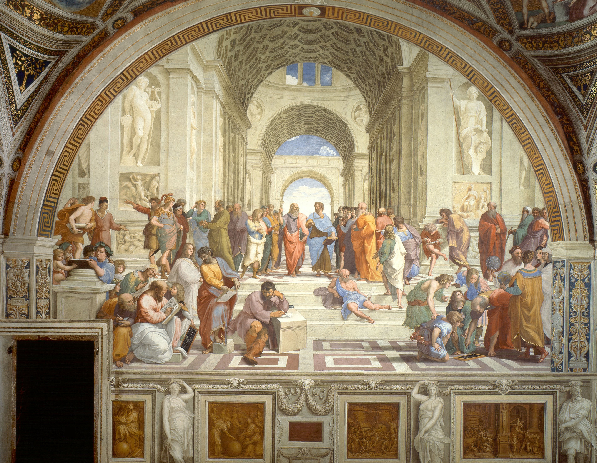
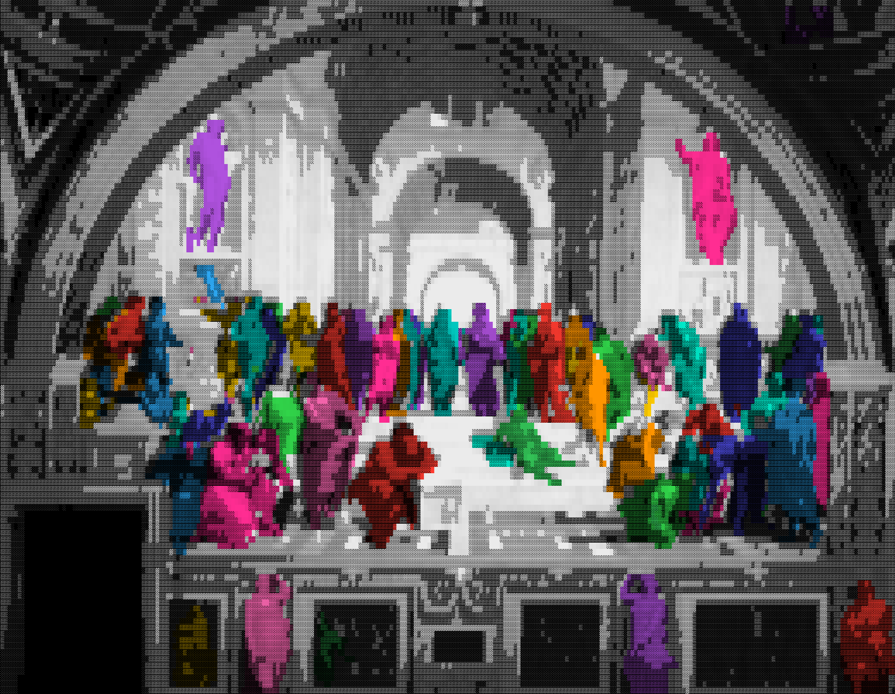

# ren-ascii-sance

[](https://github.com/Tsuskov/ren-ascii-sance/actions/workflows/lint.yml)
[](https://www.python.org)
[](LICENSE)

Figuren in Bildern (z. B. Renaissance-Gemälden) erkennen und das Original in
farbige, schattierte Block-ASCII-Art umwandeln.

**Schnellstart:** `pip install -r requirements.txt && python konturen.py bild.jpg && python ascii_art.py bild.jpg`

Die Pipeline besteht aus zwei Schritten:

1. **`konturen.py`** – erkennt Personen per YOLO-Segmentierung. Schreibt eine
   Konturvorschau (`konturen.png`) und eine Label-Karte (`figuren.png`, ein
   Pixelwert je Figur-ID). Die Defaults sind auf Gemälde abgestimmt (niedrige
   Confidence, hohe Auflösung, hohe IoU für dicht überlappende Figuren).
2. **`ascii_art.py`** – wandelt das **Originalbild** in Block-ASCII um. Die
   Helligkeit steuert die Zeichendichte aus der Rampe ` ░▒▓█` (die Form), die
   Label-Karte den Farbton je Figur (die Farbe); der Hintergrund bleibt grau
   schattiert. Ausgabe als Textdatei und als gerendertes PNG (echte
   Monospace-Schrift via Pillow).

## Beispiel

Raffael – *Die Schule von Athen* (81 erkannte Figuren).

Original (Wikimedia Commons, gemeinfrei):



Als farbige Block-ASCII-Art:



## Installation

```bash
python3 -m venv .venv
source .venv/bin/activate
pip install -r requirements.txt
```

Beim ersten Lauf lädt sich das Modellgewicht `yolo11x-seg.pt` (~120 MB)
automatisch herunter – dafür wird einmalig Internet benötigt.

## Benutzung

```bash
# 1) Bild -> Figuren erkennen (Label-Karte)
python konturen.py pfad/zum/gemälde.jpg          # -> konturen.png, figuren.png

# 2) Original + Label-Karte -> farbige, schattierte ASCII-Art
python ascii_art.py pfad/zum/gemälde.jpg         # -> ascii.txt + ascii.png
#   (lädt figuren.png automatisch; fehlt sie, rein in Graustufen)
```

## Stellschrauben

`konturen.py`:
- `confidence` – niedriger = mehr (auch gemalte) Figuren
- `bildgroesse` – höher = kleine Figuren werden besser getrennt
- `iou` – höher = stark überlappende Figuren bleiben erhalten
- `glaettung`, `linienstaerke`, `min_flaeche` – Kosmetik der Konturen

`ascii_art.py`:
- `breite_zeichen` – Detailgrad (Zeichen pro Zeile)
- `schriftgroesse` – Blockgröße im PNG
- `PALETTE` – die Farbtöne je Figur

## Hinweise

- Das Foto-trainierte Modell erkennt auch Statuen und Relieffiguren als Personen.
- Am Bildrand angeschnittene Figuren können kleine Kanten-Artefakte erzeugen.

## Font

Das PNG-Rendering nutzt `Menlo` (macOS). Auf anderen Systemen `FONT_PFAD` in
`ascii_art.py` auf eine vorhandene Monospace-TTF setzen.
