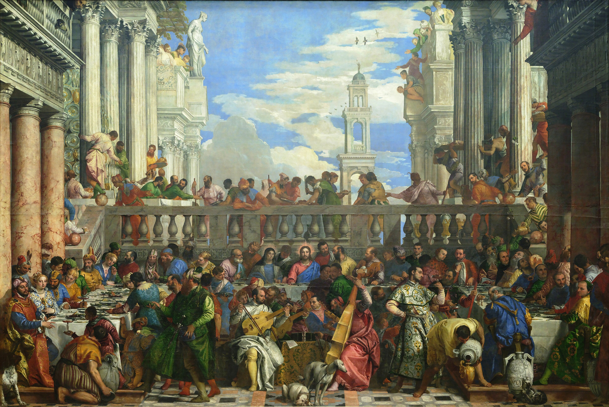
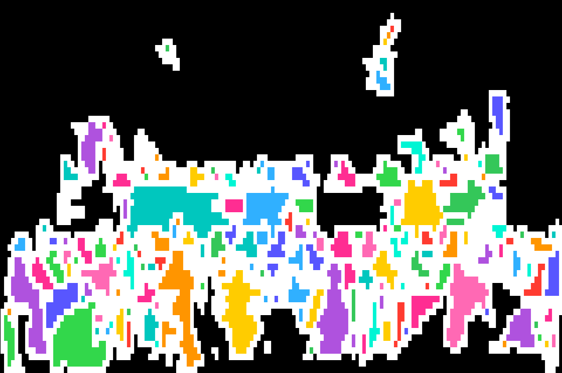

# ren-ascii-sance

Figuren in Bildern (z. B. Renaissance-Gemälden) erkennen, als Konturlinien
rendern und in farbige Block-ASCII-Art umwandeln.

Die Pipeline besteht aus zwei Schritten:

1. **`konturen.py`** – erkennt Personen per YOLO-Segmentierung und zeichnet nur
   ihre Umrisse als weiße Linien auf schwarzem Hintergrund. Die Defaults sind
   auf Gemälde abgestimmt (niedrige Confidence, hohe Auflösung, hohe IoU für
   dicht überlappende Figuren).
2. **`ascii_art.py`** – wandelt das Kontur-Bild in Block-ASCII (`█`) um und füllt
   jede geschlossene Fläche mit einer poppigen Farbe. Ausgabe als Textdatei und
   als gerendertes PNG (echte Monospace-Schrift via Pillow).

## Beispiel

Paolo Veronese – *Die Hochzeit zu Kana* (171 erkannte Figuren).

Original (Wikimedia Commons, gemeinfrei):



Als farbige Block-ASCII-Art:



Raffael – *Die Schule von Athen* (81 erkannte Figuren).

Original (Wikimedia Commons, gemeinfrei):


Als farbige Block-ASCII-Art:


## Installation

```bash
python3 -m venv .venv
source .venv/bin/activate
pip install -r requirements.txt
```

Beim ersten Lauf lädt sich das Modellgewicht `yolo11x-seg.pt` (~120 MB)
automatisch herunter – dafür wird einmalig Internet benötigt.

## Benutzung

```bash
# 1) Bild -> Konturen
python konturen.py pfad/zum/gemälde.jpg          # -> konturen.png

# 2) Konturen -> farbige ASCII-Art
python ascii_art.py konturen.png                 # -> ascii.txt + ascii.png
```

## Stellschrauben

`konturen.py`:
- `confidence` – niedriger = mehr (auch gemalte) Figuren
- `bildgroesse` – höher = kleine Figuren werden besser getrennt
- `iou` – höher = stark überlappende Figuren bleiben erhalten
- `glaettung`, `linienstaerke`, `min_flaeche` – Kosmetik der Konturen

`ascii_art.py`:
- `breite_zeichen` – Detailgrad (Zeichen pro Zeile)
- `schriftgroesse` – Blockgröße im PNG
- `PALETTE` – die Füllfarben

## Hinweise

- Das Foto-trainierte Modell erkennt auch Statuen und Relieffiguren als Personen.
- Am Bildrand angeschnittene Figuren können kleine Kanten-Artefakte erzeugen.

## Font

Das PNG-Rendering nutzt `Menlo` (macOS). Auf anderen Systemen `FONT_PFAD` in
`ascii_art.py` auf eine vorhandene Monospace-TTF setzen.
